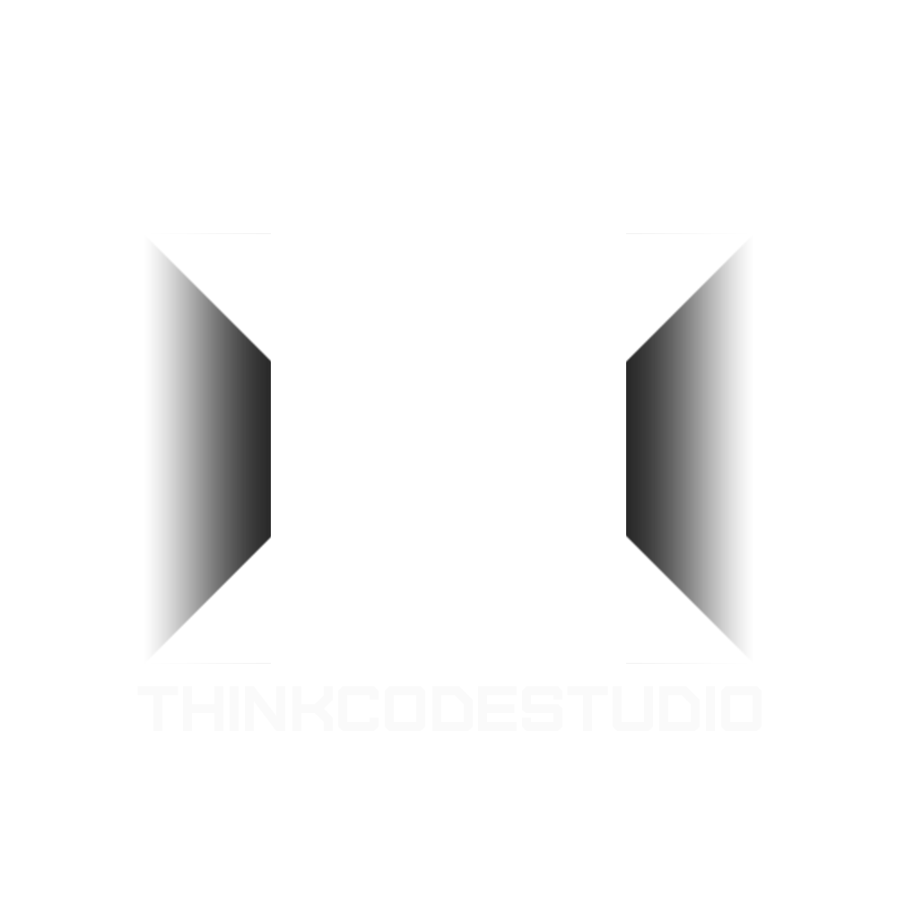

<h3 align="center">
   
  THINK CODE STUDIO
</h3>

# 让我们变得更强💪  
 

**ing...**

* [可编程客制机械键盘](https://github.com/ThinkCodeStudio/DIYkeyboard)
* [世界线变动率探测仪 辉光管时钟](https://github.com/ThinkCodeStudio/DivergenceMeter)

**Futrue&Plan**

| 计划                            |     状态     | 
| :------------------------------ | :---------:  |
|~~esp2866开机模块~~                   |   主板上没有找到合适的供电方案  |
|STM32_NES                        |              |
|ESP32图传                        |       20%      |
|[原神乐器弹奏器](https://github.com/ThinkCodeStudio/GenshinPlayer)|   🛠开发中 60%, 并入键盘项目  |
|通用快接计算模块                 |       使用rk3588       |
|鱼叉潜艇                         |             |
|圆形表盘，原神钟表                |              |
|明日方舟x皇家国教骑士团           |              |
|枪焰壁纸渲染                      |              |
|3D打印 克莱伯狙击枪               |      1%      |
|战地1视频剪辑                     |🎞素材收集中  |
|电磁轨道枪的理论研究              |              |  
|klipper USB直连计算模块 全志H5    |放弃🤩[较满意产品](https://www.bilibili.com/video/BV1D94y1D7Es)|  
|[Voron2.4 3D打印机](https://github.com/ThinkCodeStudio/my_voron2.4_3dPrinter)| 🎉完成 |  
|[计算机性能监视器](https://github.com/ThinkCodeStudio/PCresource)| 考虑使用USB |   
|[开关控制](https://github.com/ThinkCodeStudio/esp-01s_control_servo)|       🎉完成     | 
|纸模 皇家国教骑士团 阿卡多双枪     |   🎉完成   |  
|舟味穿搭                          |              |  
|[带屏幕的编码器 smartknob](https://github.com/ThinkCodeStudio/smartknob) |   暂时放弃  |
|3D打印 莫辛纳甘obrez              |              |
|[世界线变动率探测仪 辉光管时钟](https://github.com/ThinkCodeStudio/DivergenceMeter)        |   📐设计中   |
|霜星干员演示视频                  |               |
|动作同步机器人                    |               |
|[可编程客制机械键盘](https://github.com/ThinkCodeStudio/DIYkeyboard)|  🛠开发中 50% |
|airhaed 手书                      |               |
|数独开发                          |               |
|[方舟华为主题](https://www.bilibili.com/video/BV1hP4y1t7Sn)|     🎉完成    |
|设计华为表盘                      |               |
|pad数学软件                       |               |
|CG 太空特别行动                   |               |
|CG 泥岩VS爱国者                   |               |
|远程电子鞭炮点燃装置              |                |
|[个人网站](https://github.com/ThinkCodeStudio/blog) |  📐设计中   |
|Live 2d 开发                      |               |

 
 

  
  
  
  
  
  

  
  
  

