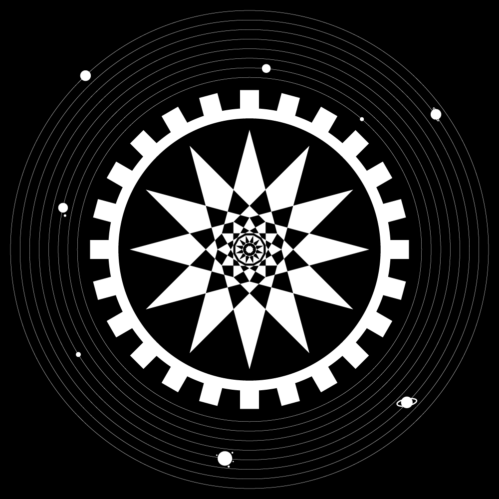

<h3 align="center">
   
  THINK CODE STUDIO
</h3>

# 让我们变得更强💪  
 

**Now**

* [Voron2.4 3D打印机](https://github.com/ThinkCodeStudio/my_voron2.4_3dPrinter)

**Futrue&Plan**

| 计划                            |     状态     | 
| :------------------------------ | :---------:  |
|明日方舟x皇家国教骑士团           |              |
|枪焰壁纸渲染                      |              |
|3D打印 克莱伯狙击枪               |              |
|战地1视频剪辑                     |🎞素材收集中  |
|OpenHarmony手机 全志芯片          |              |  
|电磁轨道枪的理论研究              |              |  
|klipper USB直连计算模块 全志H5    |放弃？🤩[较满意产品](https://www.bilibili.com/video/BV1D94y1D7Es)|  
|[Voron2.4 3D打印机](https://github.com/ThinkCodeStudio/my_voron2.4_3dPrinter)             | 🛠开发中 90% |  
|[计算机性能监视器](https://github.com/ThinkCodeStudio/PCresource)                        | 🛠开发中 50% |  
|typore自制主题                    |              |  
|开关控制 鸿蒙生态                 |              | 
|纸模 皇家国教骑士团 阿卡多双枪     |   🎉完成 视频ing    |  
|舟味穿搭                          |              |  
|[带屏幕的编码器 smartknob](https://github.com/ThinkCodeStudio/smartknob)                  |        ⚙准备中      |
|3D打印 莫辛纳甘obrez              |              |
|3D打印 AT筒子                     |              |
|3D打印 绝区零 比利·奇德的左轮手枪  |              |
|漂流 卫星定位相机                  |              |
|[世界线变动率探测仪 辉光管时钟](https://github.com/ThinkCodeStudio/DivergenceMeter)        |   📐设计中   |
|霜星干员演示视频                  |               |
|动作同步机器人                    |               |
|[可编程客制机械键盘](https://github.com/ThinkCodeStudio/DIYkeyboard)| 📐设计中 |
|airhaed 手书                      |               |
|三体web运动结构                   |               |
|数独开发                          |               |
|[方舟华为主题](https://www.bilibili.com/video/BV1hP4y1t7Sn)|     🎉完成    |
|设计华为表盘                      |               |
|3D建模 时间枪                     |               |
|pad数学软件                       |               |
|电子八音盒                        |               |
|CG 太空特别行动                   |               |
|CG 泥岩VS爱国者                   |               |
|远程电子鞭炮点燃装置              |               |
|树莓派W适配俄罗斯方块             |               |
|[个人网站](https://github.com/ThinkCodeStudio/blog) |  📐设计中   |
|Live 2d 开发                      |               |

 
 

