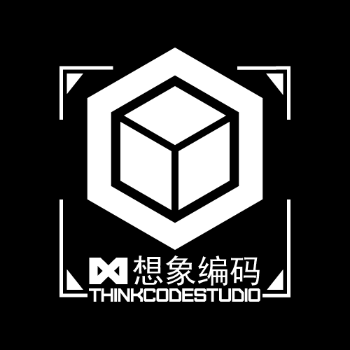
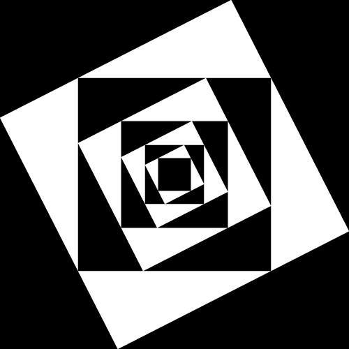
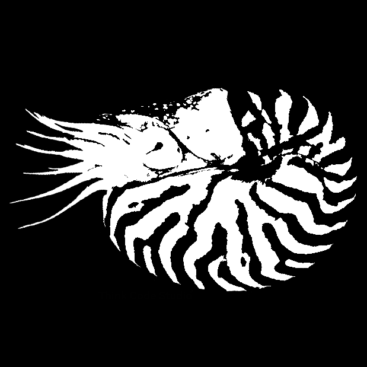
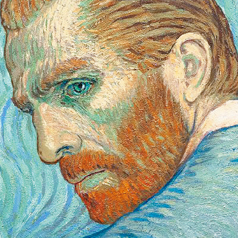

 
 

  
  
  
  
  
  

  
  
  

 <!--
只要我愿意, 那我就可以
文明其精神, 野蛮其体魄
我们的征途是星辰大海
人类是最弱小的物种, 没有强悍的肉体, 没有致命的毒液, 但凭借智慧与谋略成为了地球的顶级掠食者.
我的青春不会结束, 它还在燃烧, 它还没有到达最热最燃的时刻.
科学就是魔法
理想主义者改变世界
有条件要上, 没有条件创造条件也要上
实验是检验真理的唯一途径
把自己能控制的事做到极致
一切不是客观上的不可能都是借口
自己的理想要自己去实现
那么, 游戏开始吧
!-->
